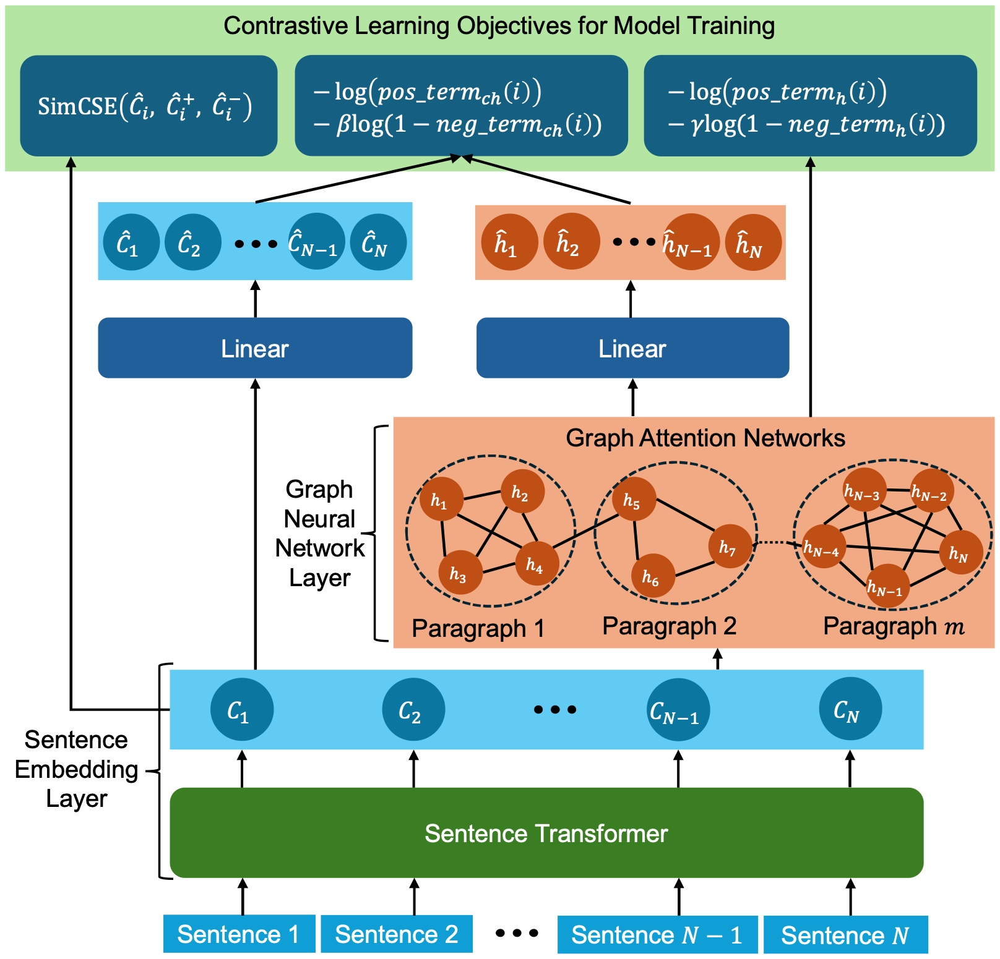

# IText: Contrastive Self-Supervised Learning for Text Incoherence Detection (BigData 2025)

**Abstract**: Coherence is one of the desirable properties that determines the quality of AI-generated texts. Coherence ensures that the ideas are connected in a logical flow and the consistency in information and facts is maintained. Therefore, models for understanding and detecting incoherence are crucial to achieve high-quality AI text generation capabilities. In this paper, we focus on the task of detecting sentences that are inconsistent with the overall document context. Supervised models may not be viable for this task due to the lack of labeled data on text incoherence. Therefore, we propose a contrastive self-supervised learning method that relies on both semantic content and neighborhood contexts of sentences for detecting incoherence. We propose a complex model that integrates graph neural networks with language models to contrast and compare two representations of each sentence—one based on its content and the other on its neighborhood context—for detecting incoherent sentences. Extensive experiments on several real-world datasets show the effectiveness of our proposed method.



## Environment Installation

Run command below to install python virtual environment:
```
conda env create -f environment.yml
```

## Download Datasets

You can download data from this [Data](https://www.dropbox.com/scl/fo/synobjwmglqbg3ys10asl/AH9BsH99jved6PrRBVqwQx0?rlkey=ac8pnz6hxwcx7q9bcasp9o8t3&st=1awqvo0k&dl=0) and put it in root directory as belows:
- IText
    - data
        - CSAbstructs
        - wikinews_20_30
        - csintro_100
        - simple_wikipedia
    - src


## Run Model

Create a shell script file at root directory with the content below:
```
#! /bin/sh

source activate torch2


datamodule=${1:-CSAbstructs_doc_datamodule}
# datamodule=${1:-wikinews_doc_datamodule}
# datamodule=${1:-simple_wikipedia_doc_datamodule}
# datamodule=${1:-cs_intro_doc_datamodule}
model=${2:-CL_SimCSE_GAT_model}

scrn_session="IText_$datamodule"

export TOKENIZERS_PARALLELISM=false
export HYDRA_FULL_ERROR=1
export CUDA_VISIBLE_DEVICES=0

screen -dmS $scrn_session python -W ignore src/main.py \
    datamodule=$datamodule \
    module=$model \
    module.gnn_lr=1e-4 \
    trainer.max_epochs=60 \
    trainer.check_val_every_n_epoch=1 \
    trainer.devices=[0]

screen -r $scrn_session
```

Now you can run the model without activating virtual environment.

## Citation

add bibtex later

## Contact

If you have any question, please contact us via email: ntphuong@nmsu.edu
